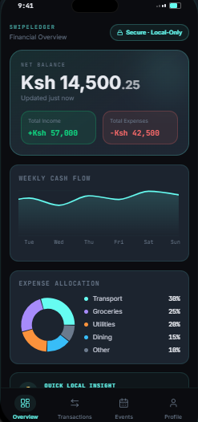
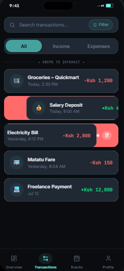
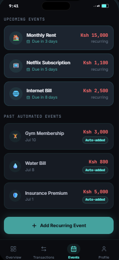
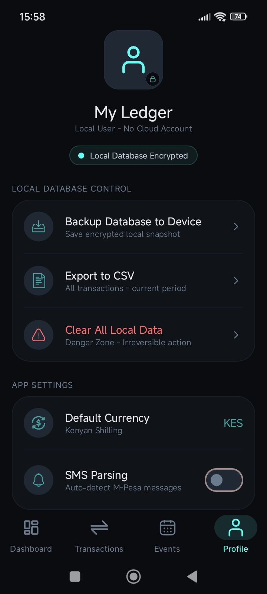

# SwipeLedger

**Automatic, on-device bookkeeping for small and informal businesses.**

SwipeLedger listens for incoming M-Pesa style mobile money confirmation SMS, parses them into structured transactions, classifies them into expense/income categories, and stores everything in an encrypted local database — no backend, no cloud account, no data ever leaves the device.


---

## Screenshots

<table align="center">
  <tr>
    <td align="center"><br><sub><b>Dashboard</b></sub></td>
    <td align="center"><br><sub><b>Transactions</b></sub></td>
  </tr>
  <tr>
    <td align="center"><br><sub><b>Events</b></sub></td>
    <td align="center"><br><sub><b>Profile</b></sub></td>
  </tr>
</table>

---

## Features

### 📊 Dashboard
- **Net balance** card with total income and total expenses at a glance, rendered in your selected currency.
- **Weekly cash flow** chart bucketing expenses Monday–Sunday.
- **Animated expense breakdown** — a donut chart of spend by category, with a percentage-of-total legend.
- Everything is derived reactively from the transaction stream — no separate analytics pass, no stale caches.

### 💳 Transactions
- Segmented **All / Income / Expenses** tabs.
- Debounced live search across counterparty name, category, subcategory, and amount.
- Each row shows counterparty, category · subcategory, and a signed, color-coded amount (income vs. expense).
- Transactions are exclusively derived from parsed SMS — there's no manual entry, by design: the ledger stays a faithful record of what actually happened on your phone.

### 📅 Events
- Define **recurring or one-time expected expenses** (rent, subscriptions, bills) with an amount, a due date, and a recurrence interval (none / weekly / monthly / yearly).
- Optional reminder notifications (one hour before / the day before / none).
- **Upcoming Events** and **Past Automated Events** sections — past recurring events that have already fired are marked *Auto-added*.
- Long-press an event card for a confirm-to-delete flow (with haptic feedback), which also cancels its scheduled alarm.
- Reminders survive a reboot: alarms are rescheduled automatically on device boot.

### 👤 Profile & Settings
- **Local Database Control** — back up the encrypted database to your device, export all transactions to CSV, or clear all local data (behind a destructive-action confirmation).
- **Default currency** selector for how amounts are displayed app-wide.
- **SMS Parsing** toggle, with a nudge to disable battery optimization for the app so background SMS capture stays reliable on aggressive OEM power managers.
- No accounts, no sign-in — "My Ledger" is a local user profile only.

---

## How it works

```
Incoming SMS
     │
     ▼
SmsReceiver  ──enqueues──▶  SmsParseWorker (WorkManager, expedited)
                                     │
                                     ▼
                          TransactionProcessor
                     ┌───────────────┴───────────────┐
                     │                                │
          filter non-financial senders          RegexParser
                                                       │
                                                       ▼
                                                LocalClassifier
                                                       │
                                                       ▼
                                          TransactionRepository
                                                       │
                                                       ▼
                                    Encrypted Room database (SQLCipher)
```

- **`RegexParser`** currently recognizes two M-Pesa confirmation shapes: money *sent/paid to* a party (expense) and money *received from* a party (income).
- **`LocalClassifier`** assigns a category using deterministic keyword matching (e.g. "kplc"/"water" → Power & Water, "shell" → Fuel & Gas Stations, "uber"/"bolt" → Ride-Hailing & Taxis) — it's fast and fully offline. Despite the `ml` package name, there's no on-device model in the loop today; income transactions are always tagged as general income.
- Every transaction lands in a **Room database opened through SQLCipher**, so the ledger is encrypted at rest.

### Category taxonomy

Transactions are classified into a two-level taxonomy — 7 top-level categories covering ~26 subcategories:

`Housing & Utilities` · `Phone & Connectivity` · `Food & Dining` · `Transportation` · `Financials & Fees` · `Personal Care & Shopping` · `Education & Family` — plus `Income` and an `Uncategorized` fallback for anything the classifier can't confidently place.

---

## Architecture

Three Gradle modules with a strict, one-directional dependency chain:

```
app  ──▶  feature  ──▶  core
```

- **`core`** — domain models, the `TransactionRepository` interface and Room/SQLCipher implementation, Koin DI wiring, and the shared Compose theme.
- **`feature`** — every screen (Dashboard, Transactions, Events, Profile) plus the SMS ingestion pipeline, organized by feature package. Each screen with a ViewModel owns its own Koin module.
- **`app`** — the thin shell: `Application` class wiring Koin and WorkManager, `MainActivity`, and the navigation graph.

Built with **Jetpack Compose** for UI, **Koin** for dependency injection (no Hilt/Dagger), and **WorkManager** for background SMS processing.

See [`CLAUDE.md`](./CLAUDE.md) for a deeper architectural walkthrough.

---

## Tech stack

| Layer            | Library                                   |
|-------------------|--------------------------------------------|
| Language          | Kotlin 2.4.0                               |
| UI                | Jetpack Compose (BOM 2026.06.01), Material 3, Navigation-Compose |
| DI                | Koin 4.2.2                                 |
| Persistence       | Room 2.8.4 + SQLCipher (`net.zetetic:sqlcipher-android`) 4.17.0 |
| Preferences       | AndroidX DataStore-Preferences             |
| Background work   | WorkManager 2.11.2                         |
| Testing           | JUnit4, MockK, kotlinx-coroutines-test, Espresso |

---

## Permissions

| Permission | Why it's needed |
|---|---|
| `RECEIVE_SMS` / `READ_SMS` | Detect and read incoming mobile money confirmation messages |
| `POST_NOTIFICATIONS` | Deliver event reminder notifications |
| `RECEIVE_BOOT_COMPLETED` | Reschedule event reminder alarms after a device reboot |

---

## Privacy & security

- **No backend.** SwipeLedger has no server component and makes no network calls to sync your data — everything lives on your device.
- **Encrypted at rest.** The transaction database is opened through SQLCipher, so the underlying SQLite file is encrypted on disk.
- **No accounts.** There's nothing to sign in to and nothing to leak from a cloud service, because there isn't one.

---

## Building the project

Standard Gradle wrapper commands from the project root (PowerShell):

```powershell
./gradlew.bat assembleDebug              # build debug APK
./gradlew.bat build                      # full build (all modules)
./gradlew.bat test                       # run all JVM unit tests
./gradlew.bat :feature:test              # unit tests for one module (app | core | feature)
./gradlew.bat connectedAndroidTest        # instrumented tests, needs an emulator/device
./gradlew.bat lint                       # Android lint
```

**Requirements:** `compileSdk` 37, `minSdk` 24 (`core`/`feature`) / 27 (`app`), `targetSdk` 37, JDK 17.

---

## Project structure

```
SwipeLedger/
├── app/       # Application shell, MainActivity, navigation graph
├── core/      # Domain models, repositories, Room/SQLCipher database, shared theme
└── feature/   # Dashboard, Transactions, Events, Profile screens + the SMS pipeline
```
